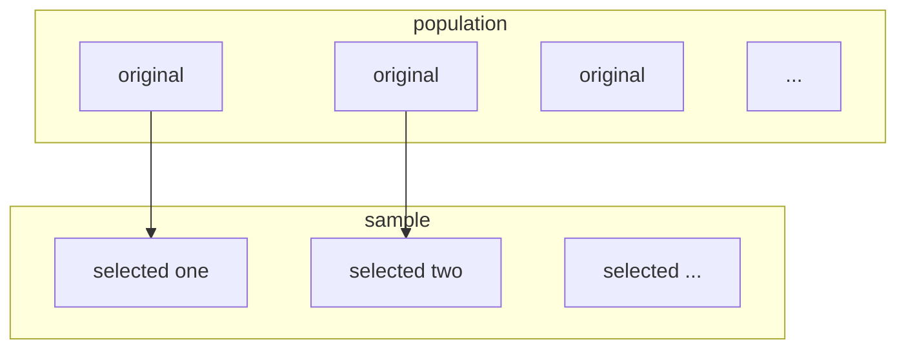

[TOC]


### task
- [x] some ppt file. probability ,
- [ ] some ppt file  elec , 
- [ ] some ppt file goverment
- [ ] if you can . do some geeks
- [ ] running

time line

#### task1 probability file

- [x] 打开转至mobi 10分钟

##### chapter1
##### introdcution
**probability** mesaures uncertainty formally , quantitatively . it is the mathematical language of uncertainty
**statistics** show some useful information from the uncertain data , and provide the basis for making decisions of choosing actions.


##### some basic concepts
** population **
an investigation will typically focus on a well-defined collection of objects(units) . a population is the set of all objects of interest in a particular study.
** variables ** 
any characteristic whose value(categorical or numerical ) may change from one object to another in the population
- keyword:  change , value , population

** sample **  
a subset of the population



> tips : according to the number of the variables under investigation, we have 
> > unvariate : 1 variable
> > bivariate : 2 variables
> > mulvariate: more than variables

** inferential statistics ** 
use some information to draw some types of conclusion(make a inference of some sort) about the population

#### the relation of probability probability and statistics

** population to sample : deductive(推断) reasoning (probability)**
** sample to population : inductive(归纳) reasoning (inferential statistics)  **

##### some notation
** sample size **: by **n* ***
> tips : give a data set consisting of n observations on some variables x , the individual observations will be denoted by $$$ x_1 , x_2 , x_3 , ... , x_n$$$


#### display
##### stem-and-leaf displays
** premises **: suppose we have a numerical data set $$$ x_1 , x_2 , ..., x_n$$$ for which each x~i~ consists of at least two digits.
** steps ** :
> 1. select one or more leading digits for the stem values , the training digits become the leaves
> 2. list possible stem values in a vertical column
> 3. record the leaf for every observations beside the corresponding stem value
> 4. indicate the units for stems and leaves someplace in the display

from R
```R
x <- c(16 , 33 , 64 , 37 , 31)
stem(x)
```

repeated from R
```R
stem(x , scale = 2)
```

L : denotes the range 0 ,1 , 2 , 3 , 4
H : denotes the range 5, 5 , 7 , 8 , 9

##### dotplot
** premises **: the data set is reasonably small or there are relatively few distinct data values
> 1. each observation is represented by a dot above the corresponding loation on a horizontal measurement scale
> 2. when a value occurs more than once , there is a dot for each occurence , and these dots are stacked vertically.


##### histogram 

#### types of variables
> 1. discrete variables: a variable is discrete if its set of possible values either is a finite or else can be listed in an infinite sequence.
> 2. continuous cariables: a variable is continuous if its possibale values consists of an entire interval on the number line.

