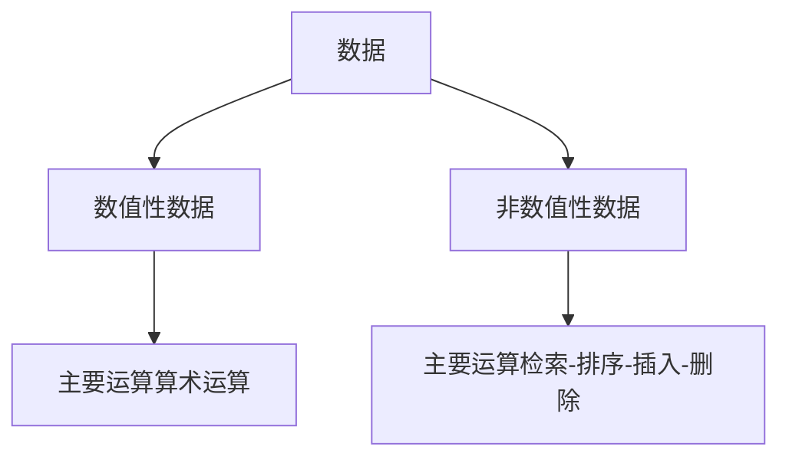
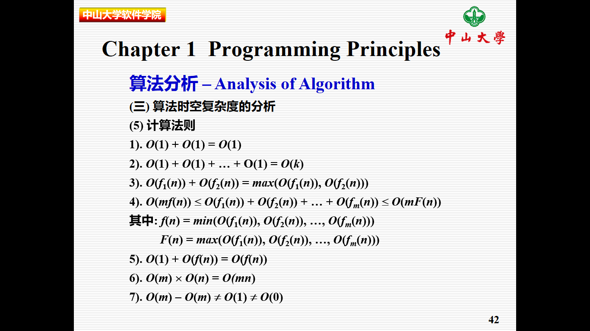

[TOC]

<h3 id='1'>数据结构</h3>
### chapter1 programming principles
#### tips
> 1. always name your classes ,variables and functions with the greatest care ,and explain them thoroughly
#### 算法
1. 算法是解决问题的方法
2. 算法是程序的核心，算法的好坏决定程序的处理效率
3. 数据的分类

##### 算法的特性
1. 有穷性
2. 确定性
3. 可行性
4. 输入
5. 输出

##### 算法分析
1. 定性评价：正确性，健壮性，可读性
2. 定量评价：时间复杂度， 空间复杂度

##### 算法时空复杂度的分析
1. 空间复杂度
算法的空间复杂度是指在算法执行过程中，算法程序所占用的内存单元数量
程序所用内存单元数量 = 算法所处理的数据占据的内存单元数量 + 处理数据所需要的额外的内存单元数量
2. 时间复杂度
假设： 算法所处理的数据量为n,所花费的时间为T(n)
函数T(n)在正整数定义范围内一定是单调递增的。

###### 时间复杂度的度量
1. 定义一： 对于函数$$$f(n) \space g(n)$$$,若$$$\exists c , n_0 \in Z^{+}, n \geq n_0$$$,都有$$$f(n) \leq cg(n)$$$,则$$$f(n) = O(g(n))$$$
tip : 常见的时间复杂度

$$O(1) < O(log_2n) < O(n) < O(nlog_2n) < O(n^2) < O(n^3) < O(2^n)$$

2. 定义二：对于函数$$$f(n) \space g(n)$$$,若$$$\exists c , n_0 \in Z^{+}, n \geq n_0$$$,都有$$$f(n) \geq cg(n)$$$,则$$$f(n) = \Omega(g(n))$$$ 

3. 定义三： 若:$$$f(n) = O(g(n)) f(n) = \Omega(g(n))$$$则称$$$f(n) = \theta(g(n))$$$

#### 基本概念
1. 数据（Data）: 客观事物的符号表示，客观事物的信息化反映
2. 数据元素(Data Element)：数据的基本单位
3. 数据项(Data Item):组成数据的不可分割的最小单元，若干个数据项组成一个数据
4. 数据对象(Data Object):数据元素类(Data Element Class)是具有相同性质数据元素的集合，数据的一个子集

#### 数据结构基本内容
1. 数据的逻辑结构（数据元素之间的关系）
2. 数据的操作
3. 数据的存储结构

##### 数据结构的基本结构
1. 集合
2. 线性结构
3. 树形结构
4. 图形结构或网状结构

##### 数据的存储结构
1. 顺序存储结构
2. 链式存储结构
3. 索引存储结构
4. 散列存储结构

