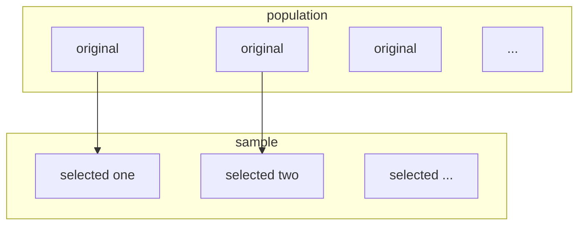
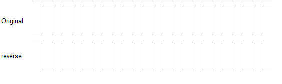
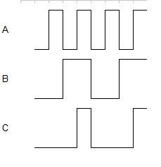
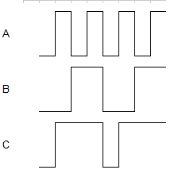
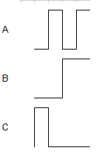

[TOC]


### task
- [x] some ppt file. probability ,
- [ ] some ppt file  elec , 
- [ ] some ppt file goverment
- [ ] if you can . do some geeks
- [ ] running

time line

#### task1 probability file

- [x] 打开转至mobi 10分钟

##### chapter1
##### introdcution
**probability** mesaures uncertainty formally , quantitatively . it is the mathematical language of uncertainty
**statistics** show some useful information from the uncertain data , and provide the basis for making decisions of choosing actions.


##### some basic concepts
** population **
an investigation will typically focus on a well-defined collection of objects(units) . a population is the set of all objects of interest in a particular study.
** variables ** 
any characteristic whose value(categorical or numerical ) may change from one object to another in the population
- keyword:  change , value , population

** sample **  
a subset of the population



> tips : according to the number of the variables under investigation, we have 
> > unvariate : 1 variable
> > bivariate : 2 variables
> > mulvariate: more than variables

** inferential statistics ** 
use some information to draw some types of conclusion(make a inference of some sort) about the population

#### the relation of probability probability and statistics

### ** population to sample : deductive(推断) reasoning (probability)**
** sample to population : inductive(归纳) reasoning (inferential statistics)  **

##### some notation
** sample size **: by **n* ***
> tips : give a data set consisting of n observations on some variables x , the individual observations will be denoted by $$$ x_1 , x_2 , x_3 , ... , x_n$$$


#### display
##### stem-and-leaf displays
** premises **: suppose we have a numerical data set $$$ x_1 , x_2 , ..., x_n$$$ for which each x~i~ consists of at least two digits.
** steps ** :
> 1. select one or more leading digits for the stem values , the training digits become the leaves
> 2. list possible stem values in a vertical column
> 3. record the leaf for every observations beside the corresponding stem value
> 4. indicate the units for stems and leaves someplace in the display

from R
```R
x <- c(16 , 33 , 64 , 37 , 31)
stem(x)
```

repeated from R
```R
stem(x , scale = 2)
```

L : denotes the range 0 ,1 , 2 , 3 , 4
H : denotes the range 5, 5 , 7 , 8 , 9

##### dotplot
** premises **: the data set is reasonably small or there are relatively few distinct data values
> 1. each observation is represented by a dot above the corresponding loation on a horizontal measurement scale
> 2. when a value occurs more than once , there is a dot for each occurence , and these dots are stacked vertically.


##### histogram 

#### types of variables
> 1. discrete variables: a variable is discrete if its set of possible values either is a finite or else can be listed in an infinite sequence.
> 2. continuous cariables: a variable is continuous if its possibale values consists of an entire interval on the number line.


### digital circuits
#### 逻辑门
练手
- [x] 13720654  27 分56秒69毫秒
- [x] 54370537  30 分27秒66毫秒

##### 反相器
- 否定指示是一个小圆圈($$$ \circ$$$): 当其出现在任何逻辑元件的输入或输出位置时， 为反相或者是反码。
- 一般情况下， 输入位于逻辑符号的左侧而输出位位于右侧，当出现在输入位置时，表示0电平有效或者是确定的输入状态，而这个输入称为低电平有效，
- 当出现在输出位置时， 该小圆圈指明0有效或者是确定的输出状态，而这个输出称为低电平

###### 真值表
输入 | 输出 
-- | - - -
0 | 1
1 | 0

##### 反相器运算


###### 时序图
- 时序图给出了两个或更多的波形在时间上的相互关系
###### 逻辑表达式
- 布尔表达式使用变量和运算来描述逻辑电路
- 反相器的逻辑表达式(取输入为A,输出为X)

$$
X = \overline {A}
$$

##### 与门
- 名词“门”用以描述运行基本逻辑运算的电路，与门由两个或更多的输入和一个输出组成。
- 当且仅当与门所有的输入都是高电平的时候，才会输出高电平


###### 两输入与门真值表
A | B | X
--- | -- | - - 
0 | 0 | 0
0 | 1 | 0
1 | 0 | 0
1 | 1 | 1

###### 与门的逻辑表达
A , B 作为输入 ， X 作为输出
$$
X = A \cdot B
$$

###### 时序图


##### 或门
- 当任意一个及一个以上的输入是高电平的时候， 或门的输出就是高电平

###### 或门的逻辑表达式
X作为输出 , A , B作为输入
$$
X = A + B
$$

###### 时序图


##### 与非门
- 除了输入被反相之外，与非门和与门是一样的。
###### 两输入与非门
1. 对于一个2输入与非门，当输入A与B都是高电平时，输出就是低电平，当输入A或B是低电平时，输出X就是高电平
###### 真值表
两输入与非门(A,B作为输入,X作为输出)
A | B | X
-- | -- | - - 
0 | 0 | 1
0 | 1 | 1
1 | 0 | 1
1 | 1 | 0

###### 与非门的非-或等价运算
1. 与非门的内在特性是这样的：一个或多个低电平输入产生一个高电平输出。
2. 与非门运算的这个功能称为非-或运算

###### 与非门的逻辑表达式
输入为A,B输出为X
布尔表达式为
$$X = \overline{AB}$$
##### 或非门运算


###### 除了输出反相之外，或非门和或门相同
- 除了反相之外，或非门和或门相同

###### 或非门的运算

当任何一个输入为高电平时，或非门就输出一个低电平，只有当所有的输入都是低电平时，输出才是高电平


###### 2输入或非门真值表
A | B | 输出
-- | -- | --  
0 | 0 | 1 
0 | 1 | 0
1 | 0 | 0
1 | 1 | 0


###### 波形图输入运算


###### 或非门的非-与等价运算
###### 或非门的逻辑表达式
$$X = \overline {A + B}$$

##### 异或门
异或门(XOR)只有两个输入，异或门的运算功能为模-2运算（只有当两个输入处于相反的逻辑电平时，异或门的输出才是高电平）
###### 异或门真值表
A | B | X
-- | -- | - - 
0 | 0 | 0
0 | 1 | 1
1 | 0 | 1
1 | 1 | 1

##### 同或门
XNOR,只有两个输入，当两个输入逻辑电平相反时，同或门的输入为低电平，相同时为高电平
###### 同或门真值表
A | B | X
0 | 0 | 1
0 | 1 | 0
1 | 0 | 0
1 | 1 | 1


