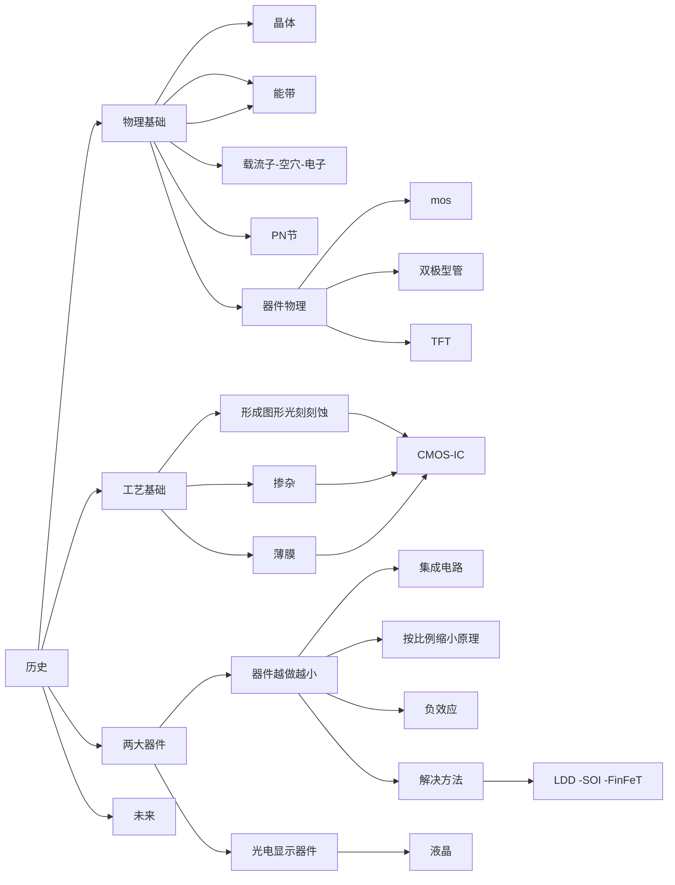

[TOC]

#### 微电子概论
了解微电子技术领域发展历史，规律，方向
##### 发展历史
1. 几个发明
> 1. 晶体管
> 2. 集成电路
> 3. 摩尔定律
2. 基本概念
3. 微电子，器件，加工工艺

##### 物理基础
晶体
> 1. 发现， 特性
> 2. 特别
##### 工艺基础

#### 干货
重点： 基本概念
1. 微电子学的定义
2. 微电子学研究内容
3. 器件物理定义
4. 微电子器件定义

1. 名词解释
